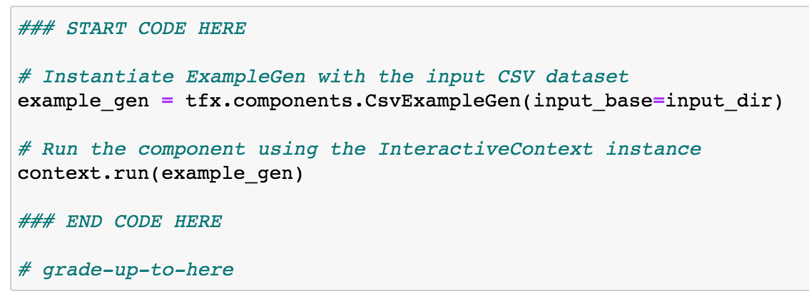

Now all of the assignments of this course support partial grading. 

However, this feature does not work by default. You need to explicitly state up to what point you have completed the assignment.

To use this feature, include the comment # grade-up-to-here or # grade up to here in the last cell that you wish to be evaluated and subsequent cells will be omitted from the grading process. This way, you will know if you are on the right track before finishing the whole assignment. Please only put this tag inside an Exercise cell (i.e. cells with the ### START CODE HERE markers) and not in other cells (e.g. unit test cells).

 

